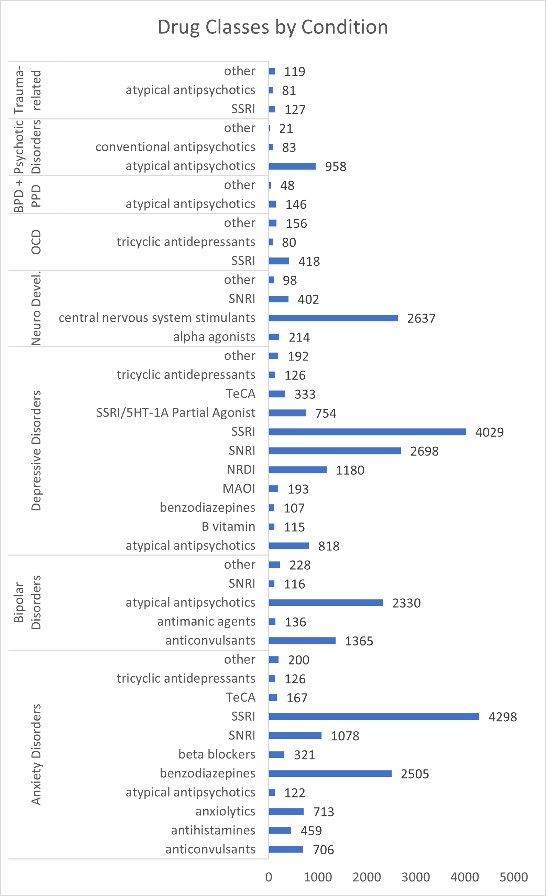
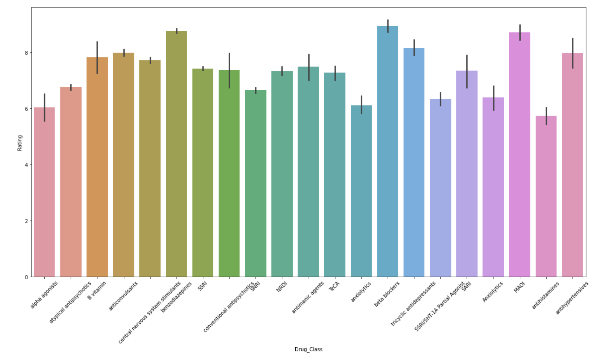
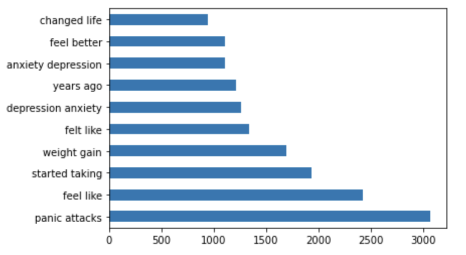
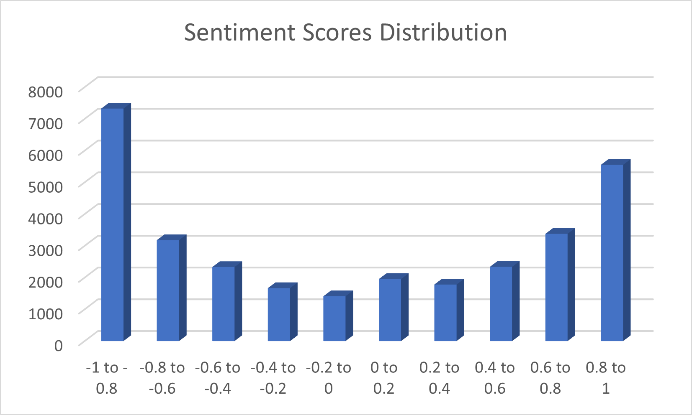
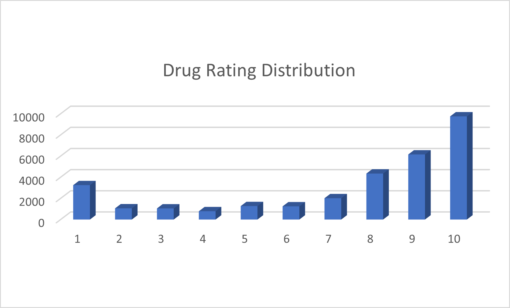

# Predicting Psychotropic Medication Ratings
### By Preethi Panyam

# Introduction
Psychotropic medications are widely prevalent in the United States, with about 20% of U.S. adults taking some kind of prescription medication to treat a mental health disorder (CDC, 2000). Antidepressants are among the most common, used by about 13% of all adults and 25% of women over 60. Inspite of the prevalance of psychotropic medications in the U.S., there is large variance in the efficay of these medications actually helping patients manage their mental health disorders and symptoms.  

# Goal
The goal of this project is to determine whether it is possible to predict how effective specific psychotropic drugs are at treating various mental health disorders. Specifically, I was interested in assessing whether it was possible to predict patient ratings for various psychotropic medications based on the drug class, type of mental health disorder, and the patient text review.

# Data 

## Drug Review Dataset
The main dataset for this project was sourced from *UCI Machine Learning Repository: Drug Review Dataset (Kallumadi & Gräßer, 2018)*. The initial dataset was webscraped from Drugs.com and contained about 200,000 reviews with ratings for over 3,400 drugs. The dataset also contained information about the patient condition, user-rated usefulness of the review, and the review date. 
 Since I was interested only in the psychotropic drugs, I filtered the dataset to only include mental health conditions. The resulting dataset contained 30,917 reviews that captured 21 mental health conditions and about 260 psychotropic medications. 

## Drug Classes
I was also interested in what drug class each of the 259 psychotropic medications from my dataset fell under. I looked up and hand-coded the drug classes for each of the 259 drugs from *medlineplus.gov*, which contains data from the National Library of Medicene, and is a part of the National Institues of Health (NIH), and merged this with the drug review dataset. 

## Data Cleaning & Pre-processing 
For my modeling process, I retained only the drug class, mental health conditions, text review, and drug ratings (I did not use the drug name, date of review, and usefulness of the review). 
As part of my data cleaning, I dropped any drug classes that had less than 100 values (inititally had 43 drug classes, reduced to 21). I also collapsed the 20 mental health conditions into 9 classes of mental health disorders and dropped any classes that had less than 100 values. This resulted in 8 mental health disorder classes for my final dataset (anxiety, depression, bipolar, neurodevelopmental, psychotic, obsessive-compulsive, trauma-related, & personality). I also cleaned the text review data by removing quotations, special characters, numbers, and changing all text to lower-case. 

## Exploratory Data Analysis

### Drug Class, Conditions & Ratings

Relationships between drug class, mental health conditions, and drug ratings(score 1-10) were all examined. For each class of mental health disorders, there were several drug classes that were prescribed. The most common drug class per condition is shown below:

Further, analysis revealed that the average drug ratings per drug class also varied (see below):

These insights were considered in the modeling process. Further, both the conditions and drug class features were both converted to dummy variables prior to modeling.

### Text Review Data
The most common words in the text review data was checked through CountVectorizer and TF-IDF Vecrtorizer. For CountVectorizer, unigrams and bigrams were examined. The most common bigrams are shown below:

The text review analysis revealed that, as expected, the most frequent terms were  associated with mental illness, wellness, and feeling states. 

## VADER Sentiment Scores
The text review data was also converted to sentiment scores using the VADER SentimentIntensityAnalyzer. For this project, only the compond score was used, as it represents the combination of the positive, negative, and neutral scores. It was interesting to note that while many reviews had a sentiment score between -0.8 and -1, the majority of drug ratings were in the 8-10 category. These distributions are shown below:

## TF-IDF Vectorizer
The text review data was also vectorized with the TF-IDF vectorizer. Setting the min_df to 10%, max_df to 75%, and including english stop words resulted in 48 word vectors for the model. However, examination of these vectors revealed that some words were very closely related & were very similar in meaning (i.e. same words different tense); I researched how TFIDF vector scores were calculated, and decided to combine these features into one so it serves as a proxy for lemmatization. This resulted in 43 word vectors total for the model. 

# Modeling
## Initial Models & Results
For the models, I tried treating the drug ratings both as a continuous target (between 1-10) and a categorical target(10 classes, with the ratings 1-10 each representing a class). The initial models I ran were a Multinomial Naive Bayes, a Logistic Regression and a Random Forest Regressor. 
 
A Multinomial Naive Bayes model has become an increasingly popular model to use for Natural Language Processing. It works by guessing a tag for each text and calculates the likelihood for each of these tags to be in a given sample. The output represents the tag with the greatest likelihoods.  
 
A Logistic Regression model is widely used in healthcare models; it uses log-odds to predict the probabilty of each class of the target occuring.
 
A Random Forest regressor model is a meta estimator model that uses decision trees on subsamples of data to improve the accuracy and combat over-fitting of models. 
 
The results of these inital models are described below.

### Results

| Model | Train | Test | Interpretation |
|---|---|---|---|
|Naive Bayes| 0.35 | 0.35 | The scores were very low (0.35 for both train & test), so decided this was not the best model to optimize|
|Logistic Regression| 0.37 | 0.37 | The scores for the logistic regression were a little better than the Naive Bayes model (0.37 for both train & test), but still low. Also not the best model to optimize|
|Random Forest Regressor| 0.93 | 0.56 | Model was very overfit; the train accuracy is good but test accuracy is very low, so decided not to optimize| 

After running these initial models, I decided to use a RandomForestClassifier instead, since all of my predictors/features were initially categorical to begin with (prior to transforming/dummifying); thus, it sense to have a categorical target as well. 

## Final Model & Results

### Random Forest Classifier
A random forest classifier model also uses decision trees to predict categorical target variables. I initially tried using 10 classes for the drug rating target variable, and then tried collapsing them into 3 classes: low (1-3), medium(4-7) and high(8-10) ratings. Since the target classes were imbalanced, with the 'high' drug rating class representing about 65% of the data, class weight was used as a hyperparameter. A total of 6 hyperparameters were used for the model (class_weight, n_estimators, max_depth max_features, class_weight, oob_score, criterion). The results are shown below:

| Model | Train | Test |
|---|---|---|
|RFC 10 classes| 0.95 | 0.63|
|RFC 3 classes| 0.98 | 0.81 |

The results revealed that the Random Forest Classifier model predicting 3 classes of drug ratings performed the best, so this was used as the final model. 

 
| Metric | Baseline | Final Model | 
|---|---|---|
|Accuracy| 0.65 | 0.81 |
|F1 ('Low' class)| 0 | 0.71 |
|F1 ('High' class)| 0.79 | 0.88 |
|F1 Weighted| 0.51 | 0.80 |
 
The final metrics used for this model were the accuracy score, F1 score for the low and high class (since these are the most pertinent for healthcare providers, patients, and for stakeholders developing drugs) and the weighted F1 score, which represents the average of the F1 scores for each of the classes after taking class weight into consideration. When comparing to the Baseline model, the final model performed relatively well, with an accuracy of 0.81, and weighted F1 score of 0.80.

# Interpretation
The results of the final model suggest that it is possible to accurately predict patient ratings of psychotropic medications based on their class of mental health disorder, drug class (i.e. mechanism of action) and the patient text review. Though the final model was still a little overfit, this suggests that the features in the model are not comprehensive enough to capture the full scope of the problem (i.e. efficacy of psychotropic drugs for treating specific conditions).  
There are several factors that may affect the effect the efficacy of psychotropic drugs, including: comorbidities, context behind prescription, medication adherence, life events, and the lack of coordination between psychologist and psychiatrists.  
Since there are a myriad of factors that can affect mental health, a psychotropic medication rating may be influenced by these other factors since it is often difficult to distinguish whether an improvement (or setback) in mental health can be attributed to a medication alone or a combination of other factors as well. 

# Future Applications
This predictive model can be useful in several contexts: pharmaceutical companies can use these models to help with drug development, psychiatrists can get insights about which medications work best to treat specific mental health disorders, and patients themselves can determine which medications may be the most helpful to them in treating their condition (through feeding in peer feedback as the text review).  
This model can be converted to an app in which users (stakeholders, psychiatrists, and patients) can input the patient condition, class of medication, and text review of the medication in order to predict how efficacious the medication will be in treating the particular mental health disorder.  Overall, this model has the potential to improve patient outcomes and aid drug discovery. 
